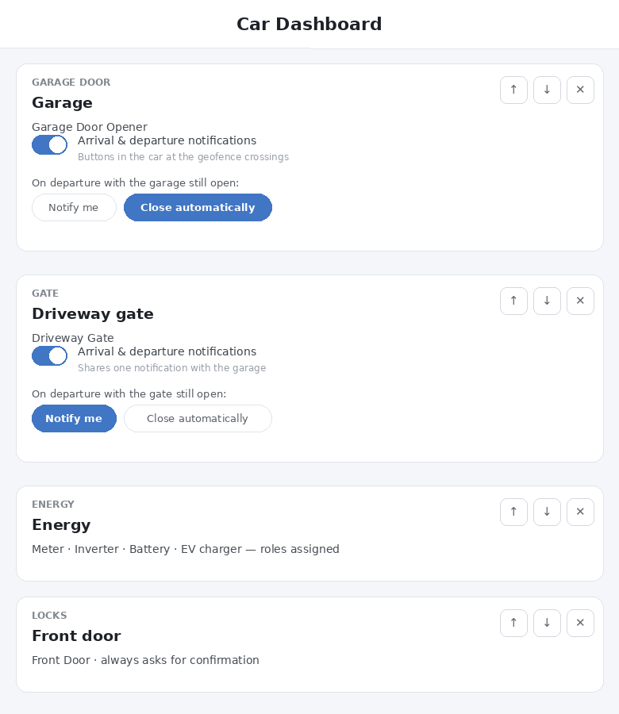

# Car Dashboard for Homey Pro

The Homey Pro companion of **[Car Dashboard for Android Automotive OS]([https://github.com/goncalb/car-dashboard-aaos])** — the app that
decides what your car may see and do, and answers its questions.

> Nothing works without the car side: install this app, then pair your car once with a code.
> Car app on Google Play: [PLAY_STORE_URL]

|                 |                          |
|-----------------|--------------------------|
| Homey App Store | [HOMEY_APP_STORE_URL]    |
| Test channel    | [HOMEY_TEST_URL]         |
| Community topic | [COMMUNITY_TOPIC_URL]    |



## What it does

**Whitelists, not mirrors.** In the app's settings you decide exactly what the car can see:

- **Tiles** for the Home grid: Garage door, **Gate** (garage-door-class or lock-class devices,
  one-tap by design), Locks, Blinds, Window/contact sensors, Temperature, and an **Energy** tile.
  Each tile has its own label — the car shows your words, not device names.
- **Lights** by room, with the room order you drag.
- **Scenes** — the Flows you tick become buttons in the car.
- **Energy roles** — point once at your meter, inverter, battery and EV charger; the car gets live
  flows and daily totals from Homey Energy (consumption is house-only when a charger role is set).
- **Geofence behaviour per barrier tile**: include it in arrival/departure notifications, and choose
  what happens on departure — notify with a button in the car, or close/lock automatically (with a
  receipt notification).

**Per-car tokens.** Pairing codes are generated here and die on use; each car gets its own revocable
token scoped to the whitelist. A fleet view shows every paired car with its last activity — rename or
revoke at any time.

## API surface (consumed by the car app)

| Endpoint  | Purpose |
|-----------|---------|
| `POST /pair` | `{code, name}` → issues a car token |
| `GET /state?carToken=` | Whitelisted tiles, lights, scenes, energy — everything the car renders |
| `POST /action` | `{tileId, action, carToken}` — token in the **body** |
| `GET /devices` | Settings UI only (effective class: `virtualClass \|\| class`) |

The app requests `homey:manager:api` to read device state and energy reports; nothing leaves your
Homey except to your own paired cars through Athom's cloud.

## Install

From the App Store: [HOMEY_APP_STORE_URL]. From source (Homey CLI):

```
git clone [https://github.com/goncalb/com.barradas.cardashboard]
cd homey-app
npm i -g homey && homey login
homey app install
```

## Compatibility notes

- Devices reassigned in Homey via **virtual class** are honoured everywhere (a socket marked as a
  light appears in the Lights picker) — thanks to Simone Di Maio for the report.
- Blind state prefers position (`windowcoverings_set`) over the last motor command.
- Gate tiles map open/close to `garagedoor_closed` or `locked` by capability.

## Related projects

[Android Automotive by Simone Di Maio](https://homey.app/a/com.dimapp.aaos)
([car](https://github.com/s-dimaio/HomeyAutomotive) · [Homey](https://github.com/s-dimaio/com.dimapp.aaos))
— the other Homey ↔ AAOS bridge, with an OAuth relay and generic rendering. Ideas flow both ways.

## License

[GNU GPL v3.0](LICENSE) — free to use, study, modify and share; derivatives must stay open
under the same license.

## Author

Gonçalo Barradas
